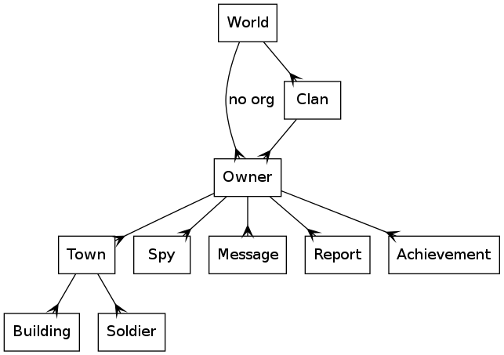

# GreaseMonkey

This is a first step to improve the UX of [Schlacht um Kyoto](http://schlacht-um-kyoto.de), a medieval browser game placed in Japan.

**This project is deprecated and may contain potential security vulnerabilities! You have been warned**

# Setup

 1. Get [Greasemonkey](https://addons.mozilla.org/en-US/firefox/addon/greasemonkey/)
 1. Get [Firebug](https://addons.mozilla.org/en-US/firefox/addon/firebug/)
 1. RightClick the Firebug icon and activate all modules
 1. Toggle `javascript.options.showInConsole` and `javascript.options.strict` to `true` in [about:config](about:config)
 1. Clone the repo: `git clone https://github.com/Ryuno-Ki/Enhanced-SuK.git $HOME/src/GMscripts/`
 1. Start Firefox and Open the File via `Ctrl-O`
 1. Start a terminal and navigate to `$HOME/.mozilla/firefox/*default*/gm_scripts/Enhance_Schlacht-um-Kyoto/`
 1. Remove the `SuK.user.js` there and symlink it with the git tracked one: `rm SuK.user.js && ln -s $HOME/src/Enhanced-SuK/SuK.user.js $HOME/.mozilla/firefox/*default*/gm_scripts/Enhance_Schlacht-um-Kyoto/`
 1. Log in to [Schlacht-um-Kyoto](http://schlacht-um-kyoto.de) and open the file via RightClick in GreaseMonkey menu

# Relationship between Instances (somewhat ER)

# Dependencies

 * jQuery v1.6.2 (since it is used inside the game anyway)
